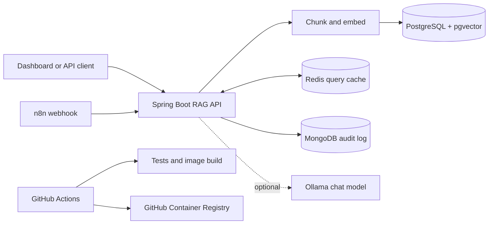

# RAG Automation Platform

[](https://github.com/JavaProgswing/rag-n8n-spring-platform/actions/workflows/ci.yml)
[](https://github.com/JavaProgswing/rag-n8n-spring-platform/actions/workflows/publish-container.yml)
[](https://adoptium.net/)
[](https://spring.io/projects/spring-boot)

A production-oriented retrieval-augmented generation project built with Java, Spring Boot, n8n, PostgreSQL/pgvector, MongoDB, and Redis. It runs without an API key in local mode and can use a local Ollama model for generated, citation-aware answers.

## What it does

- Ingests text through the REST API, dashboard, or an n8n webhook.
- Splits documents into overlapping chunks and creates deterministic 384-dimensional embeddings.
- Retrieves the closest chunks in memory for a zero-setup demo or from PostgreSQL with pgvector in production.
- Produces keyless extractive answers, with optional Ollama generation.
- Caches repeat questions in Redis and invalidates them when the knowledge base changes.
- Stores query and ingestion audit events in MongoDB.
- Exposes health, metrics, and service status endpoints.
- Builds and tests every change with GitHub Actions, then publishes the application image to GHCR.

## Architecture



| Component | Responsibility |
|---|---|
| Spring Boot | REST API, validation, retrieval, answer orchestration, dashboard |
| PostgreSQL + pgvector | Documents, chunks, vector similarity search |
| MongoDB | Append-only ingestion and query audit events |
| Redis | Time-limited query response cache |
| n8n | Validated document-ingestion webhook automation |
| Ollama | Optional local answer generation; no cloud key required |

## Run locally now

Local mode needs only Java 21. It keeps vectors, cache entries, and audit events in memory.

```powershell
.\mvnw.cmd spring-boot:run
```

Open [http://localhost:8080](http://localhost:8080), or run the automated smoke test in a second PowerShell window:

```powershell
.\scripts\smoke-test.ps1
```

## Run the complete stack

Install Docker Desktop, then:

```powershell
Copy-Item .env.example .env
# Change the example passwords and encryption key in .env.
docker compose up --build
```

The services are:

- Dashboard and API: [http://localhost:8080](http://localhost:8080)
- n8n: [http://localhost:5678](http://localhost:5678)
- Spring health: [http://localhost:8080/actuator/health](http://localhost:8080/actuator/health)

The compose stack imports and activates `RAG - Document Ingestion Webhook`. After creating the first n8n owner account, call its production webhook:

```powershell
$body = @{
  title = "Support handbook"
  source = "n8n-webhook"
  content = "Priority one incidents require an acknowledgement within fifteen minutes."
} | ConvertTo-Json

Invoke-RestMethod `
  -Method Post `
  -Uri http://localhost:5678/webhook/knowledge-ingest `
  -ContentType application/json `
  -Body $body
```

## Optional Ollama answers

The default answer provider quotes the best matching passages and needs no model download. To generate a composed answer, install Ollama, pull a model, and set this in `.env`:

```powershell
ollama pull llama3.2:3b
```

```dotenv
ANSWER_PROVIDER=ollama
OLLAMA_BASE_URL=http://host.docker.internal:11434
OLLAMA_CHAT_MODEL=llama3.2:3b
```

Restart the application service after changing the values:

```powershell
docker compose up -d --build app
```

## API

### Ingest a document

`POST /api/v1/documents`

```json
{
  "title": "Incident handbook",
  "source": "internal-runbook",
  "content": "When Redis is unavailable, restart the service and verify connectivity."
}
```

### Ask a question

`POST /api/v1/query`

```json
{
  "question": "How should Redis be recovered?",
  "topK": 4,
  "conversationId": "incident-42"
}
```

The response contains the answer, similarity-ranked source chunks, their scores, a cache flag, and a conversation ID.

### Inspect runtime status

`GET /api/v1/status`

The endpoint reports the document count and active vector, cache, audit, and answer providers.

## Configuration

| Variable | Default | Purpose |
|---|---|---|
| `SPRING_PROFILES_ACTIVE` | default local profile | Use `production` for the database-backed stack |
| `ANSWER_PROVIDER` | `extractive` | Set to `ollama` for generated answers |
| `OLLAMA_BASE_URL` | `http://localhost:11434` | Ollama API address |
| `OLLAMA_CHAT_MODEL` | `llama3.2:3b` | Ollama chat model |
| `POSTGRES_*` | development values | PostgreSQL connection and initialization |
| `MONGODB_URI` | local development URI | MongoDB audit database |
| `REDIS_PASSWORD` | `ragredis` | Redis authentication |

See [.env.example](.env.example) for the complete deployment template.

## Development

Run all tests and create the executable JAR:

```powershell
.\mvnw.cmd verify
```

The project includes tests for chunk overlap, normalized embeddings, ingestion, retrieval, cache behavior, API status, and validation. CI also validates the Compose file and builds the container image.

## Deployment

Every push to `main` runs CI and publishes:

```text
ghcr.io/javaprogswing/rag-n8n-spring-platform:latest
```

Pull that image into any Docker or Kubernetes environment and provide the same production environment variables shown in `compose.yml`.

## License

Released under the [MIT License](LICENSE).
